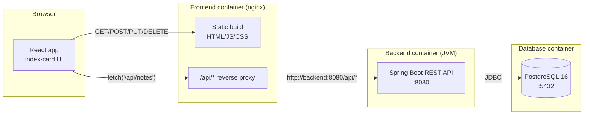

# Pinboard — Full Setup & Architecture Guide

This is the complete walkthrough for the notes app: what it is, why it's built
the way it is, how to run it (Compose or Kubernetes), and what actually
happens when you do.

---

## 1. What you have

A three-tier CRUD app for notes:

- **Frontend** — React (Vite), served by nginx once built. UI theme is a
  "pinboard": notes render as pinned index cards instead of a generic
  list/table.
- **Backend** — Java 21, Spring Boot 3, exposes a REST API for notes.
- **Database** — PostgreSQL 16.
- **Orchestration** — either Docker Compose (`docker-compose.yml`) or
  Kubernetes manifests (`k8s/`), your choice. Same containers, same images,
  two different ways of wiring them together.

```
notes-app/
├── .github/workflows/
│   └── ci-cd.yml             build/test backend & frontend, build+push Docker images
├── backend/                 Spring Boot API (Maven project)
│   ├── src/main/java/com/notesapp/
│   │   ├── NotesApplication.java     entry point
│   │   ├── model/Note.java           JPA entity (the "notes" table)
│   │   ├── repository/NoteRepository.java   Spring Data interface
│   │   ├── controller/NoteController.java   REST endpoints
│   │   ├── config/CorsConfig.java    allows the frontend origin
│   │   └── exception/                404 + validation error handling
│   ├── src/main/resources/application.yml   config (DB connection, port, CORS)
│   ├── pom.xml               Maven dependencies
│   └── Dockerfile            multi-stage build → runnable jar
├── frontend/                 React app (Vite project)
│   ├── src/
│   │   ├── App.jsx            page layout, state, data fetching
│   │   ├── api.js             axios client for the backend
│   │   └── components/        NoteGrid, NoteCard, NoteForm
│   ├── nginx.conf            serves the built app + proxies /api
│   └── Dockerfile            multi-stage build → static files + nginx
├── docker-compose.yml         db + backend + frontend, wired together
├── k8s/                       same app, as Kubernetes manifests
│   ├── 00-namespace.yaml … 09-frontend-service.yaml
│   └── README.md              Kubernetes-specific instructions
└── README.md                   quick-start (this file has the full story)
```

---

## 2. Architecture



Two important things this diagram is telling you:

1. **The browser never talks to the backend directly.** It only ever talks to
   nginx (frontend container) on one origin. nginx forwards anything under
   `/api/` to the backend container over the internal Docker/Kubernetes
   network. This is why you can open `http://localhost:3000` (Compose) or
   `http://localhost:30080` (Kubernetes) and everything just works — no CORS
   dance needed for normal browser traffic. CORS config in the backend
   (`CorsConfig.java`) exists as a safety net for cases where you call the
   API directly (Postman, curl, a different frontend host during dev), not
   because the deployed app depends on it.
2. **Nothing is exposed except the frontend.** Postgres and the backend are
   only reachable inside the container network (Compose's default bridge
   network, or the Kubernetes ClusterIP Services). Postgres's `5432:5432`
   port mapping in `docker-compose.yml` is there purely so *you* can connect
   a local DB client for debugging — it's not something the app itself
   relies on, and it's absent from the Kubernetes version on purpose.

---

## 3. Does the database need to already exist? (No.)

Short answer: **no manual setup required, on either path.** Two separate
auto-creation mechanisms are stacked here, and it's worth knowing what each
one actually does:

**a) The database itself (`notesdb`) is created by the official Postgres
image, once, the first time it starts with an empty data directory.**
That's not a Spring Boot feature — it's built into `postgres:16-alpine`
itself: on first boot, if `/var/lib/postgresql/data` is empty, the image runs
its own init scripts and creates a database/user/password from the
`POSTGRES_DB` / `POSTGRES_USER` / `POSTGRES_PASSWORD` environment variables
(`docker-compose.yml`'s `db` service, or the `postgres-secret` Secret in
`k8s/`). On every *subsequent* start, Postgres sees the data directory is no
longer empty and skips init — your data just persists.

**b) The `notes` table inside that database is created by Hibernate, not by
you or Postgres.** That's controlled by this line in
`backend/src/main/resources/application.yml`:

```yaml
spring:
  jpa:
    hibernate:
      ddl-auto: update
```

`update` tells Hibernate: on startup, look at the `@Entity` classes
(`Note.java`), compare them to what's actually in the database, and
create/alter tables as needed to match. So the first time the backend
connects to a fresh `notesdb`, it creates the `notes` table itself from the
`Note` entity definition. You never write or run a `CREATE TABLE`.

This is genuinely convenient for local dev and is why the whole stack comes
up from nothing with a single `docker compose up` / `kubectl apply`. It is
**not** what you'd want in a real production setup, for two reasons: (1)
`ddl-auto: update` can only add columns/tables, it won't safely handle
renames or drops, so schema drift accumulates messily over time; (2) it gives
every app instance permission to alter the schema at boot, which is risky
once more than one person or environment touches the same database. The
standard fix is a migration tool — **Flyway** or **Liquibase** — where you
write explicit, version-controlled SQL migration files and set
`ddl-auto: validate` (Hibernate checks the schema matches but never changes
it). That's flagged as a "before this goes anywhere real" item in both
READMEs.

---

## 4. Why these specific technology choices

### Why `application.yml` instead of `application.properties`?

Nothing to do with "not being Spring" — both are 100% standard, first-class
Spring Boot config formats, equally supported, and you can even mix formats
across different profiles if you really wanted to. This app uses YAML purely
for readability, for one specific reason: **Spring Boot config keys are
deeply nested**, and YAML lets you write that nesting once instead of
repeating the prefix on every line.

Same config, two ways:

```properties
# application.properties — repeats the prefix every line
spring.datasource.url=jdbc:postgresql://${DB_HOST}:${DB_PORT}/${DB_NAME}
spring.datasource.username=${DB_USER}
spring.datasource.password=${DB_PASSWORD}
spring.jpa.hibernate.ddl-auto=update
spring.jpa.show-sql=false
```

```yaml
# application.yml — nesting expresses the same structure once
spring:
  datasource:
    url: jdbc:postgresql://${DB_HOST}:${DB_PORT}/${DB_NAME}
    username: ${DB_USER}
    password: ${DB_PASSWORD}
  jpa:
    hibernate:
      ddl-auto: update
    show-sql: false
```

At this app's size the difference is minor; it gets more noticeable as config
grows (multiple `spring.*`, `server.*`, `app.*`, `management.*` blocks, or
per-environment `---` profile sections in one file). `.properties` is an
equally valid choice — switching is a mechanical, low-risk change if a
project's convention calls for the flatter format instead.

### Why Spring Boot for the backend?

Given Java as the language, Spring Boot is the default choice for a REST API
today: it wires up an embedded web server, JSON serialization, and a JPA/ORM
layer (Hibernate) with almost no manual configuration, has first-class
Postgres support, and is what most Java job postings and existing codebases
assume. The alternative (raw Java + Jakarta EE, or a lighter framework like
Javalin) means writing a lot of the plumbing Spring Boot provides for free.

### Why React + Vite (not Create React App, Next.js, etc.)?

- **Vite** over Create React App because CRA is effectively unmaintained at
  this point; Vite is the current standard — much faster dev server and
  build times, and simpler config.
- **Plain React + Vite** rather than **Next.js** because this app doesn't
  need server-side rendering, file-based routing, or API routes — it's a
  single-page app talking to a separate backend. Next.js would add
  complexity (its own server process, a different build/deploy shape) for
  no benefit here. If you later want SSR/SEO or a more content-heavy site,
  Next.js would be worth reconsidering.

### Why PostgreSQL?

Postgres is the standard choice for a relational, transactional dataset like
notes — mature, free, works identically across Docker, Kubernetes, and
managed cloud services (RDS, Cloud SQL, etc.), and Spring Data JPA supports
it natively.

### Why Docker Compose?

Compose is the standard tool for running a small multi-container app locally
during development: one YAML file declares all the services, one command
(`docker compose up`) builds and starts everything wired together, and
rebuild/restart cycles are fast. It has no cluster concepts (pods, scheduling,
self-healing) to reason about — which is exactly the point for local
iteration, where that overhead doesn't buy anything.

### Why Kubernetes, in addition to Compose?

Kubernetes is what a production deployment of an app like this would
typically run on — it's included here so the deployment shape can be
developed and tested locally before it ever has to run somewhere real.
Rancher Desktop bundles a k3s cluster alongside its Docker-compatible engine
specifically to make that possible: the same machine that runs
`docker compose up` for quick iteration can also run `kubectl apply` against
a real (if local) Kubernetes API.

Both paths use the exact same Docker images (`notes-backend`,
`notes-frontend`) — nothing about the app itself changes between the two;
only how the containers are told to find each other and what's exposed
outside the container network.

### Why multi-stage Dockerfiles?

Both `Dockerfile`s build in one stage and run in another (`FROM ... AS build`
→ `FROM ...` runtime). The build stage has the full JDK+Maven (backend) or
Node+npm (frontend) toolchain, which is large and irrelevant at runtime; the
final image only contains the built jar / static files plus a minimal
runtime (`eclipse-temurin:21-jre` / `nginx:alpine`). Net effect: much smaller
final images, faster container startup, smaller attack surface (no compiler
toolchain sitting in your production image).

### Why nginx for the frontend, instead of `npm run dev` or a Node server?

`vite build` produces plain static files (HTML/JS/CSS) — there's no need for
a Node process to serve them at runtime. nginx is a small, fast, standard way
to serve static files and also do the `/api` reverse-proxy job described in
section 2, in one lightweight container.

---

## 5. Full setup — Docker Compose path

### Prerequisites

- [Rancher Desktop](https://rancherdesktop.io/) installed.
- Container Engine set to **`dockerd (moby)`**
  (Rancher Desktop → Preferences → Container Engine). This is what gives you
  the standard `docker` and `docker compose` CLI, and — relevant later — lets
  locally-built images be seen directly by the bundled Kubernetes cluster.
- Rancher Desktop **running** (its whale/icon shows it's ready) before you
  run any `docker` command.

Verify:

```bash
docker version
docker compose version
```

### Run it

```bash
cd notes-app
docker compose up --build
```

What happens, in order:

1. Compose builds `backend` and `frontend` images from their Dockerfiles.
2. It starts `db` (Postgres) first and waits for its healthcheck
   (`pg_isready`) to pass — see `depends_on: db: condition: service_healthy`
   in `docker-compose.yml`. This matters: without it, the backend could try
   to connect before Postgres is accepting connections yet.
3. Postgres, on its first-ever start, creates the `notesdb` database/user
   (section 3a above).
4. `backend` starts, connects to `db`, and Hibernate creates the `notes`
   table (section 3b above).
5. `frontend` starts (nginx), serving the built React app and proxying
   `/api` to `backend`.

### Use it

- App: **http://localhost:3000**
- API directly: **http://localhost:8080/api/notes**
- Postgres (for a DB client, e.g. `psql` or TablePlus): `localhost:5432`,
  user `notes`, password `notes`, database `notesdb`.

### Stop it

```bash
docker compose down          # stop + remove containers, keep data
docker compose down -v       # also delete the Postgres volume (wipes notes)
```

---

## 6. Full setup — Kubernetes path

### Prerequisites

Same Rancher Desktop, plus:

- Kubernetes enabled: Preferences → Kubernetes → **Enable Kubernetes**
  (any recent stable version).
- `kubectl` pointed at the right cluster:
  ```bash
  kubectl config use-context rancher-desktop
  kubectl get nodes    # sanity check — should show one node, Ready
  ```

### Build images locally

```bash
cd notes-app
docker build -t notes-backend:local ./backend
docker build -t notes-frontend:local ./frontend
```

Because Container Engine is `dockerd (moby)`, these images are immediately
visible to the bundled k3s cluster — **no registry, no `docker push`
needed.** This is also why every Deployment in `k8s/` sets
`imagePullPolicy: IfNotPresent`: it tells Kubernetes "if you already have an
image with this exact tag, use it — don't try to pull it from Docker Hub."
Without that, Kubernetes' default pull policy would try (and fail) to fetch
`notes-backend:local` from a registry that doesn't have it.

> If a pod ever gets stuck in `ErrImageNeverPull` / `ImagePullBackOff`, the
> local image isn't visible to k3s's containerd (can happen after certain
> Rancher Desktop resets, or if the engine got switched to plain
> `containerd`). Fix by importing the image directly:
> ```bash
> docker save notes-backend:local | rdctl shell sudo k3s ctr images import -
> docker save notes-frontend:local | rdctl shell sudo k3s ctr images import -
> ```

### Deploy

```bash
kubectl apply -f k8s/
```

This applies all 10 manifests. `kubectl apply` is declarative and order
mostly doesn't matter for a first apply, but the files are numbered to make
the *logical* order obvious when you read them: namespace → secrets/config →
storage → database → backend → frontend.

### Watch it come up

```bash
kubectl get pods -n notes-app -w
```

Expect, in rough order: `db` pod `Running` first, then `backend` (its
readiness probe hits `/api/notes`, so it won't show `1/1 Ready` until it can
actually reach Postgres — usually 20-30s), then `frontend`.

### Use it

- App: **http://localhost:30080**

That's the `frontend` Service's `NodePort`. NodePort was picked over
`LoadBalancer` or an `Ingress` because it's the simplest thing that works
without extra setup — it just opens a fixed port (30080, chosen arbitrarily
within Kubernetes' allowed NodePort range of 30000–32767) on the cluster
node, and Rancher Desktop automatically forwards that to `localhost` on your
machine. A `LoadBalancer` Service would also work (Rancher Desktop can
provision one via its bundled `klipper-lb`), and an `Ingress` would be the
right call if you had multiple services to route by hostname/path — neither
buys you anything extra for a single app running locally.

### After a code change

The image tag (`:local`) doesn't change when you rebuild, so Kubernetes has
no way to know a new image exists — you have to tell it:

```bash
docker build -t notes-backend:local ./backend
kubectl rollout restart deployment/backend -n notes-app
```

### Tear down

```bash
kubectl delete namespace notes-app
```

Deletes everything in one shot, including the PVC (i.e. your notes).

---

## 7. Kubernetes-specific design decisions

A few choices in `k8s/` that aren't obvious just from reading the YAML:

- **One Secret, reused by two workloads with different variable names.**
  `postgres-secret` holds `POSTGRES_DB` / `POSTGRES_USER` /
  `POSTGRES_PASSWORD` — the exact env var names the official Postgres image
  expects. The backend, though, expects `DB_NAME` / `DB_USER` /
  `DB_PASSWORD` (see `application.yml`). Rather than duplicating the values
  in a second Secret, `06-backend-deployment.yaml` maps them explicitly:
  ```yaml
  - name: DB_USER
    valueFrom:
      secretKeyRef:
        name: postgres-secret
        key: POSTGRES_USER
  ```
  One source of truth for credentials, even though the two containers were
  written by different people (Postgres's maintainers, and me) using
  different naming conventions.

- **`ConfigMap` vs `Secret` split.** Non-sensitive settings (`DB_HOST`,
  `DB_PORT`, `FRONTEND_ORIGIN`) live in a plain `ConfigMap`
  (`02-app-config.yaml`); credentials live in a `Secret`. Functionally
  Kubernetes treats them almost identically (both become env vars here) —
  the split exists so credentials are the *only* thing subject to Secret
  handling (base64 storage, RBAC that can restrict Secret access
  separately from ConfigMap access, etc.), which matters once you move
  past local dev.

- **`strategy: Recreate` on the Postgres Deployment.** Kubernetes'
  default rollout strategy (`RollingUpdate`) starts the new pod *before*
  killing the old one — normally good (zero downtime), but wrong here
  because both pods would try to mount the same `ReadWriteOnce` PVC at
  once, which fails. `Recreate` kills the old pod first, then starts the
  new one, guaranteeing only one pod ever touches the volume.

- **`PGDATA` set to a subdirectory, not the volume root.** The Postgres
  container sets `PGDATA: /var/lib/postgresql/data/pgdata` while the PVC is
  mounted at `/var/lib/postgresql/data`. If Postgres initialized directly
  into the mount root, some CSI/volume-provisioner combinations leave a
  `lost+found` directory there, which Postgres's initdb refuses to run
  against ("data directory has wrong ownership" / "not empty" errors).
  Pointing `PGDATA` one level down sidesteps that entirely — a well-known
  gotcha specific to running Postgres on Kubernetes.

- **No `StorageClass` specified on the PVC.** Left blank on purpose so it
  uses whatever the cluster's default is — for Rancher Desktop's k3s,
  that's the built-in `local-path` provisioner, which just works without
  any extra setup. You'd only need to specify one explicitly on a cluster
  with multiple storage backends to choose between.

- **Resource `requests`/`limits` are deliberately small** (e.g. backend:
  150m/750m CPU, 256Mi/768Mi memory) — sized for comfortably running all
  three pods on a laptop, not for production load. Treat these as a
  starting point to tune once you know real usage.

---

## 8. API reference

| Method | Path | Body | Response |
|---|---|---|---|
| `GET` | `/api/notes` | — | `200`, array of notes, newest-updated first |
| `GET` | `/api/notes/{id}` | — | `200` note, or `404` if it doesn't exist |
| `POST` | `/api/notes` | `{"title": "...", "content": "..."}` | `201` created note |
| `PUT` | `/api/notes/{id}` | `{"title": "...", "content": "..."}` | `200` updated note, or `404` |
| `DELETE` | `/api/notes/{id}` | — | `204`, or `404` if it doesn't exist |

Validation: `title` is required, ≤200 characters; `content` is optional,
≤10,000 characters. A `400` on invalid input includes a `fields` object
naming which field(s) failed and why (see `GlobalExceptionHandler.java`).

Every note has `id`, `title`, `content`, `createdAt`, `updatedAt` — the
timestamps are set/maintained by the backend (`@PrePersist`/`@PreUpdate` in
`Note.java`), not something you send.

---

## 9. What the result actually looks like

Opening the app, you get:

- A header — "Pinboard", a search box, and a **+ New note** button.
- Below that, a responsive grid of note cards, each styled like a pinned
  index card: a small circular "pin" at the top, a subtle rotation so the
  grid doesn't look mechanically uniform, faint ruled lines like paper, a
  monospace timestamp stamp, and Edit/Delete actions revealed per card.
- Clicking **+ New note** or **Edit** opens a small modal form (title +
  content, autofocused, validated) instead of navigating to a new page —
  keeps the whole thing feeling like a single board rather than a multi-page
  app.
- The type pairing was chosen deliberately: **Space Grotesk** for headings/UI
  chrome (geometric, a bit architectural), **Source Serif 4** for the actual
  note content (reads more like handwriting/paper than a UI label would),
  **JetBrains Mono** for metadata like timestamps (visually distinct from
  content, signals "this is system-generated, not something you wrote").
- Color palette is a warm linen/kraft-paper background with a forest-green
  accent (the "pin" color and buttons) — deliberately avoiding the generic
  cream-and-terracotta look a lot of default AI-generated UIs converge on.

Deleting a note updates the UI immediately (optimistic update) and only
rolls back if the API call actually fails — so the app feels fast even
though every action is a real network round-trip to Postgres underneath.

---

## 11. CI/CD pipeline

`.github/workflows/ci-cd.yml` runs on every push and pull request against
`main`. Three jobs:

| Job | Runs | Purpose |
|---|---|---|
| `backend-test` | `mvn -B verify` (Java 21, Maven dependency cache) | compiles the backend and runs any tests |
| `frontend-build` | `npm install` + `npm run build` (Node 20, npm cache) | catches build-breaking errors in the React app |
| `docker-build-push` | builds both Dockerfiles with Buildx; needs the two jobs above to pass first | proves the images build; **pushes** to GHCR only on an actual push to `main`, not on pull requests |

Pushed images land at `ghcr.io/<repo>/notes-backend` and
`ghcr.io/<repo>/notes-frontend`, tagged both `:latest` and `:<commit-sha>`.
No registry credentials to configure — it authenticates with the built-in
`GITHUB_TOKEN`, which already has permission to publish to GHCR for the
repository it runs in.

On a pull request, `docker-build-push` still runs (so a broken Dockerfile
fails the PR), it just skips the login/push steps — nothing gets published
until the PR is merged to `main`.

**What isn't wired up yet: actual deployment.** The pipeline builds and
publishes images but doesn't push them anywhere running — there's no
"real" cluster target yet (this app currently runs locally via Rancher
Desktop). The workflow file has a comment marking where a deploy job would
go once there's a cluster to point at: it would run `kubectl apply -f k8s/`
using a kubeconfig stored as a repository secret, with the `k8s/` manifests'
image tags switched from `:local` to `:${{ github.sha }}` so each deploy
uses the exact image the pipeline just built.

---

## 12. Troubleshooting quick-reference

| Symptom | Likely cause | Fix |
|---|---|---|
| `docker compose up` hangs on `db` | Rancher Desktop not fully started | Wait for Rancher Desktop to report "Running", retry |
| Backend container restarts in a loop | Postgres not ready yet on first boot | Compose already waits via healthcheck; on k8s, give it ~30s — check `kubectl logs deploy/backend -n notes-app` |
| `ErrImageNeverPull` on k8s pods | Local image not visible to k3s | See the `ctr images import` fallback in section 6 |
| Notes disappear after `docker compose down` | A script or command included `-v` | Don't pass `-v` unless the intent is to wipe the volume |
| Frontend loads but shows an API error | Backend not up yet, or a CORS mismatch if calling the API from a different origin than expected | Check `kubectl logs`/`docker compose logs backend`; check `FRONTEND_ORIGIN` matches wherever the app is being loaded from |
| Port already in use (`3000`, `8080`, `30080`, `5432`) | Something else on the machine is using it | Stop the other process, or edit the port mapping in `docker-compose.yml` / the `nodePort` in `09-frontend-service.yaml` |

---

## 13. What to change before this is a "real" deployment

Flagged inline above, gathered here for visibility:

1. **Schema migrations** — replace `ddl-auto: update` with Flyway/Liquibase
   + `ddl-auto: validate`.
2. **Secrets management** — plaintext `Secret`/env vars are fine for local
   dev; use Sealed Secrets, External Secrets Operator, or a vault before
   sharing this with anyone else or deploying it somewhere reachable.
3. **Postgres durability/HA** — a single pod + PVC is a single point of
   failure; a real deployment would use a managed Postgres (RDS, Cloud SQL)
   or a proper HA operator (e.g. CloudNativePG).
4. **TLS/Ingress** — NodePort is local-only convenience; anything
   internet-facing needs an Ingress controller + TLS certificates.
5. **Actual CD** — the pipeline builds and publishes images (section 11) but
   doesn't deploy them anywhere; add a deploy job once a real cluster target
   exists.

Each is independent and can be tackled in any order.
